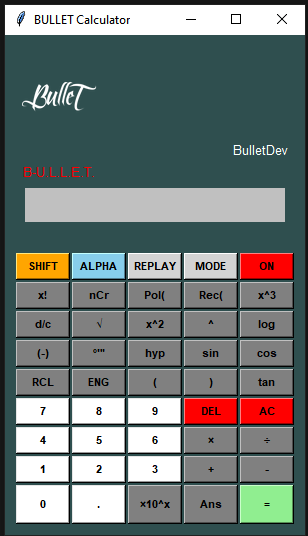

# Calculadora Cientifica    

## Descrição
Este projeto é uma simulação em software da calculadora científica, implementada em Python usando a biblioteca Tkinter para a interface gráfica. A calculadora inclui funcionalidades básicas e avançadas, replicando a aparência e o comportamento da calculadora física .

## Características
- Interface gráfica fiel à calculadora Cientifica
- Logo personalizada "Bullet" 
- Funções matemáticas básicas e avançadas
- Modos SHIFT e ALPHA para funções secundárias
- Animação de desligamento com efeito de letreiro "BYE"
- Suporte para cálculos trigonométricos e logarítmicos
- Modos de ângulo (DEG, RAD, GRAD)
- Histórico de cálculos e função REPLAY

## Requisitos
- Python 3.x
- Tkinter (geralmente vem pré-instalado com Python)
- Pillow (PIL Fork) para manipulação de imagens

## Instalação
1. Clone o repositório:
   ```
   git clone https://github.com/BulletDev/calculadora-cientifica.git
   ```
2. Navegue até o diretório do projeto:
   ```
   cd calculadora-cientifica
   ```
3. Instale as dependências:
   ```
   pip install Pillow
   ```

## Uso
Execute o script Python para iniciar a calculadora

## Funcionalidades Especiais

- **Logo Personalizada**: A calculadora exibe um logo "Bullet" personalizado.
- **Botão ON/OFF**: Ao clicar no botão ON, ele muda para OFF e exibe uma animação de "BYE" antes de fechar o aplicativo.
- **Modos SHIFT e ALPHA**: Permitem acesso a funções secundárias dos botões.

## Contribuições
Contribuições para o projeto são bem-vindas. Por favor, sinta-se à vontade para fazer fork do repositório e submeter pull requests.

## Licença
Este projeto é distribuído sob a licença MIT. Veja o arquivo `LICENSE` para mais detalhes.

## Autor
CraqueBullet

# BULLET Calculator

Este é um projeto de calculadora científica implementado em Python usando Tkinter.

## Demonstração

Aqui estão algumas capturas de tela da calculadora em ação:
<>

</>

<>

</>

