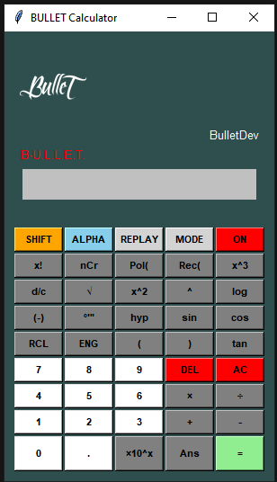
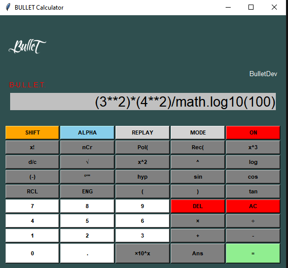
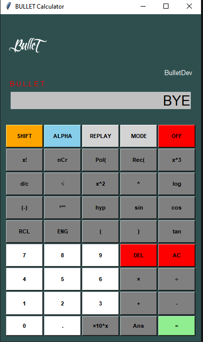

# Calculadora Cientifica    

## Descrição
Este projeto é uma simulação em software da calculadora científica, implementada em Python usando a biblioteca Tkinter para a interface gráfica. A calculadora inclui funcionalidades básicas e avançadas, replicando a aparência e o comportamento da calculadora física .

## Características 
- Interface gráfica inspirada em calculadoras científicas clássicas.
- Logo personalizada "Bullet".
- Funções matemáticas básicas (adição, subtração, multiplicação, divisão) e avançadas (fatorial, combinações, funções trigonométricas, logarítmicas, etc.).
- Modos SHIFT e ALPHA para acessar funções secundárias.
- Animação de desligamento com efeito de letreiro "BYE".
- Suporte para cálculos trigonométricos e hiperbólicos, com conversão automática de ângulos baseada no modo selecionado.
- Modos de ângulo (DEG, RAD, GRAD).
- Histórico de cálculos com função REPLAY para navegar por expressões anteriores.
- Tratamento de erros básico e avaliação segura de expressões via `eval()` com namespace restrito.

## Requisitos
- Python 2.7 ( disponível em distribuições como ActivePython ou o instalador oficial da Python.org da época).
- Tkinter (incluído por padrão no Python 2.7 para Windows/Mac; pode precisar de instalação separada em Linux via `sudo apt-get install python-tk` ou equivalente).
- PIL (Python Imaging Library) para manipulação de imagens (instale via `easy_install PIL` ou baixe de http://www.pythonware.com/products/pil

  
## Instalação
1. Clone o repositório:
   ```
   git clone https://github.com/BulletDev/calculadora-cientifica.git
   ```
2. Navegue até o diretório do projeto:
   ```
   cd Calculadora-cientifica
   ```

3. Instale as dependências (PIL):
   ```
   easy_install PIL
   ```
   (Ou baixe e instale manualmente do site oficial do PIL.)

4. Copie o arquivo `Bullet.png` (logo da calculadora) para o diretório raiz do projeto ou para um caminho acessível, como `C:\Users\SeuUsuario\Bullet.png` (substitua "SeuUsuario" pelo nome do seu usuário no Windows). O código assume que o arquivo está no diretório atual; ajuste o caminho em `Image.open("Bullet.png")` se necessário.
   
## Uso

Execute o script Python para iniciar a calculadora
```
python calculadora.py
```
## Funcionalidades Especiais

- **Logo Personalizada**: Exibe uma imagem redimensionada do logo "Bullet" no topo.
- **Botão ON/OFF**: Alterna para "OFF" e mostra uma animação de "BYE" com delay antes de fechar a janela.
- **Modos SHIFT e ALPHA**: Mudam o texto dos botões e adicionam funções como absolutos, potências de 10, e variáveis alfabéticas (A-F).
- **Conversão de Ângulos**: Funções trigonométricas (`sin`, `cos`, `tan`) ajustam automaticamente para o modo de ângulo (DEG converte para radianos, GRAD ajusta proporcionalmente).
- **Combinações (nCr)**: Implementado manualmente via fatorial, já que `math.comb` não existia em Python 2.
- **Histórico**: Armazena expressões calculadas e permite navegar com REPLAY (cicla para trás).
- **Engenharia Científica**: Converte para notação científica com `%.6e`.


## Contribuições
Contribuições para o projeto são bem-vindas. Por favor, sinta-se à vontade para fazer fork do repositório e submeter pull requests.

## Licença
Este projeto é distribuído sob a licença MIT. Veja o arquivo `LICENSE` para mais detalhes.

## Autor
CraqueBullet

## Demonstração
#Aqui estão algumas capturas de tela da calculadora em ação:




